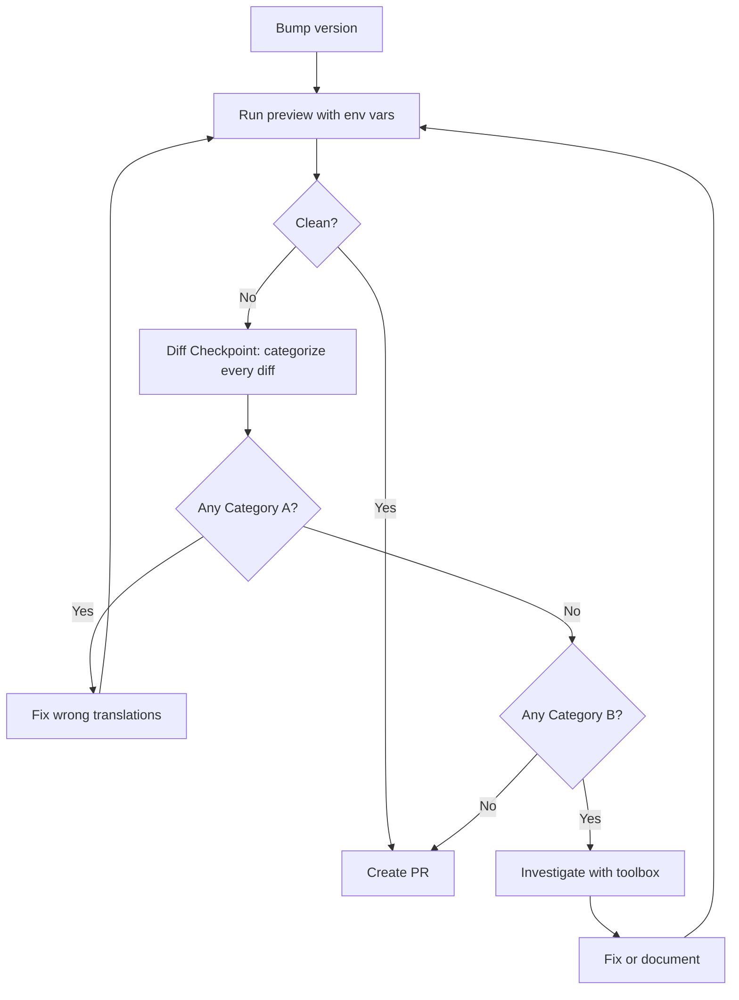

# Upgrading Pulumi Providers

## The Principle

A provider upgrade is a translation, not a change request.

The user's infrastructure intent hasn't changed - they still want the same bucket, the
same function, the same cluster. What changed is how the provider's API expresses that
intent. Your job is to translate their existing code into the new API so that Pulumi sees
no difference between what the code says and what already exists.

There are four layers to keep in mind:

1. **User intent** - what the user wants in the cloud (unchanged during an upgrade)
2. **Code** - how the program expresses that intent using the provider API (may need updating)
3. **Pulumi state** - Pulumi's stored representation of what exists (may need reconciliation)
4. **Real cloud** - the actual infrastructure (should not change during an upgrade)

During an upgrade, layers 2 and 3 may need to change so that they continue to correctly
represent the unchanged layers 1 and 4.

A correct translation produces zero diff. The Pulumi engine doesn't have a concept of
"upgrade" - it just compares goal state (your code) against actual state (the state file)
and reconciles. If the translation is correct, those two states match and nothing happens.
If you see a diff, either your translation is wrong, or something beyond a code change is
needed (import, alias, manual step). In all cases, the diff is a problem to solve, not a
consequence to accept.

## The Core Loop



1. **Bump** the provider dependency
2. **Preview** with required CLI flags
3. **Diff Checkpoint** - categorize every non-`same` resource (see next section)
4. **Fix Category A** - code changes that didn't produce `same`
5. **Investigate Category B** - diffs on resources you didn't change
6. **Repeat** until clean or remaining diffs are fully investigated
7. **Create PR** with upgrade summary

---

## The Diff Checkpoint

This is the most important section. Run this after EVERY preview.

For each non-`same` resource, answer one question:
**"Did any of my code changes affect this resource - directly or indirectly?"**

"Directly" means you edited the resource block itself. "Indirectly" means you changed
something that feeds into this resource - a shared variable, an output from another
resource, a helper function, a default value, or a resource that this one depends on.
If your changes could have altered what Pulumi computes for this resource, it's Category A.

Then follow the category that applies.

### Category A: I changed code for this resource

Your code change was supposed to translate the same intent into the new API. If the
resource shows `same`, your translation is correct. If it shows anything else, your
translation is wrong. Not "the diff is expected because I changed the code" - if the
change were semantically equivalent, there would be no diff.

**I modified an existing resource and it shows `update`:**

Your rename, restructure, or value adjustment changed the meaning, not just the syntax.
The resource would show `same` if the old and new code compiled to the same goal state.
The `update` means they don't.

Ask yourself: *"If this rename were truly equivalent, the resource would show `same`.
It doesn't. What is semantically different between my old code and my new code?"*

Common causes: the new property name maps to a different underlying field; the value
shape changed and your conversion lost or added information; a default value changed
in the new version and you need to explicitly set the old value; additional properties
now appear in the diff because the new provider version tracks fields it didn't before
(these need to be set explicitly to match the current state).

If the update includes properties you didn't change - new fields appearing, type
normalizations (string->number), additional defaults - that's the provider changing what
it tracks. But if the diff is there, `pulumi up` WILL send those values to the cloud API.
Don't assume they're no-ops. Investigate each changed property.

**I added a new resource block and it shows `create`:**

During an upgrade, a new resource block almost always represents infrastructure that
already exists in the cloud. The old provider managed it implicitly (as part of another
resource); the new provider needs an explicit resource. But the cloud object is already
there. Pulumi wants to create NEW infrastructure - that's not what you want.

The fix is `import`, not `create`. Tell Pulumi to adopt the existing cloud resource.

Ask yourself: *"What cloud object does this new resource represent? Does it already
exist? How was it managed before the upgrade?"*

```typescript
// Wrong - creates duplicate infrastructure
const stage = new aws.apigateway.Stage("prodStage", { ... });

// Right - adopts the existing resource
const stage = new aws.apigateway.Stage("prodStage", { ... }, {
    import: "<rest-api-id>/prod",  // import ID format varies by resource type
});
```

**I removed a resource block and it shows `delete`:**

A `delete` in the preview means `pulumi up` will call the provider's Delete API to
destroy or unconfigure this cloud resource. This is real destruction - not just state
cleanup. The cloud infrastructure still exists and is almost certainly still needed.

This is different from `pulumi state delete`, which removes the resource from Pulumi's
tracking WITHOUT calling the provider's API. When a resource type is removed in a new
provider version, the correct approach is:
1. `pulumi state delete '<urn>'` - manual step, removes from tracking only
2. Add replacement resources (if any) with imports - adopts the cloud state under new types
3. Verify with preview

Do NOT leave a `delete` in the preview and proceed to PR creation. A delete that runs
via `pulumi up` will destroy real infrastructure. If the resource must be removed from
state, document it as a manual step for the user.

Ask yourself: *"What cloud infrastructure does this resource manage? If `pulumi up` runs
this delete, what gets destroyed or unconfigured?"*

### Category B: I didn't change code for this resource

This diff was not caused by your code changes. It comes from the provider version change
itself - a different default, a changed state representation, or a behavioral difference.
Read `references/diagnostic-toolbox.md` and investigate.

These diffs might be:
- **Fixable with code** - set an explicit value for a changed default, add an alias
- **A documented no-op** - the upgrade guide says it resolves on `pulumi up` without
  affecting real infrastructure. This classification REQUIRES a citation from the upgrade
  guide or provider documentation. Your own judgment that "this looks like a no-op" is
  not sufficient - the user is trusting you to distinguish real infrastructure changes
  from artifacts, and getting it wrong means unexpected changes to their cloud.
- **Requiring manual steps** - state removal + reimport, documented for the user
- **Unknown** - present what you've found to the user and ask for guidance

### Category C: Provider version bump

An `update` on `pulumi:providers:{name}` showing only a version change is the one
expected diff. Verify no other properties changed on the provider resource.

### After categorizing

**Completeness check:** Every resource in the preview that shows any non-`same` state
must appear in your checkpoint - including resources with `[diff: ...]` annotations,
even if they don't have an explicit create/update/delete marker. If you didn't list it,
your checkpoint is incomplete. Go back and categorize the missing resources.

**Evidence requirement for accepted diffs:** If you want to accept any diff as "OK"
(not fix it), you need evidence - whether it's Category A or Category B. "I believe the
API treats these equivalently" or "this looks like state reconciliation" is not evidence.
Acceptable evidence: the upgrade guide documents it, a GitHub issue confirms it, or the
provider documentation explains the behavior. If you can't find evidence, either fix the
diff or flag it to the user.

**Ordering:** Fix all Category A issues before investigating Category B. Your code
corrections will change the preview output, so investigating Category B diffs first wastes
effort. Fix your own mistakes first, re-preview, then look at what remains.

**No `delete` or `replace` in the final preview.** If a delete or replace remains when
you're ready to create a PR, stop. A delete means `pulumi up` will destroy cloud
infrastructure. A replace means it will destroy and recreate. These are never acceptable
as "remaining diffs" - they must be resolved (via code fix, alias, or documented manual
steps) before proceeding.

---

## Hard Rules

### Required CLI flags

Use these flags when running preview. A preview without them can show false diffs
(phantom tag removals, region additions) that aren't real. Don't interpret a preview
that was run without them.

```shell
pulumi preview --refresh --run-program
```

- `--refresh` refreshes actual cloud state before diffing.
- `--run-program` runs the Pulumi program during refresh.

### Don't chase deprecations

If something is deprecated but still works, leave it alone. Migrating to the replacement
introduces risk for no benefit. A deprecation warning is acceptable - a diff is not.

```typescript
// BAD: migrating deprecated-but-working properties introduces risk
new aws.s3.Bucket('bucket');
new aws.s3.BucketLogging('bucketLogging', {...});  // unnecessary migration

// GOOD: fix only the actual error, leave working code alone
new aws.s3.Bucket('bucket', {
  logging: {...},  // "loggings" renamed to "logging" - real breaking change
  website: {...},  // deprecated but works - don't touch
});
```

### Be minimally invasive

Every line changed could introduce a regression. Prefer the smallest change that works.

### Do not run pulumi up

Provider upgrades modify source code and need code review before deployment.
PR -> review -> merge -> deploy via CI/CD.

---

## Getting Started

### 1. Get version information

Determine the target version from the user's request, the Pulumi Registry, package
manager metadata, or the repository's existing dependency constraints.

Default to the latest stable version if the user hasn't specified a target version.
If the user asks which stacks or projects are affected, use skill `package-usage` or
the best available package inventory tooling before making changes.

### 2. Update the dependency

- **TypeScript/JavaScript**: `npm install @pulumi/{provider}@^{version}` or `yarn add @pulumi/{provider}@^{version}`
- **Python**: Update `pyproject.toml` or `requirements.txt` with `pulumi_{provider}>={version}` (underscore, not hyphen), then install
- **Go**: `go get github.com/pulumi/pulumi-{provider}/sdk/v{major}@latest`, update all import paths (e.g., `v6` -> `v7`), run `go mod tidy`
- **.NET**: `dotnet add package Pulumi.{Provider} --version {version}`
- **Java**: Update `pom.xml` or `build.gradle` dependency version
- **YAML**: Update provider version in resource options or provider configuration. See https://www.pulumi.com/docs/iac/languages-sdks/yaml/yaml-language-reference/#providers-and-provider-versions for examples.

After installing, check the actual installed version from the lockfile (package-lock.json,
go.sum, etc.) - use these exact versions for schema-tools comparisons.

### 3. Run preview

Run `pulumi preview --refresh --run-program` immediately after updating the dependency.
Do not research breaking changes first - many upgrades just work, especially minor
versions.

If the preview is clean (only the provider version bump), create a PR.

---

## Preview Progress

Preview can fail on the first error and hide others. Fixing one error often reveals new
errors. This is normal progress, not a sign that fixes are making things worse.

- **New or different errors** -> progress, continue
- **Error set shrank** -> progress, continue
- **Same error persists** -> your fix didn't work, try a different approach
- **No errors but diffs** -> run the diff checkpoint

---

## Upgrade Summary

Once the preview is clean (or as clean as possible), present the summary:

```
## Upgrade Summary: {provider} v{current} -> v{target}

### Code Changes
| File | Change | Why it preserves intent |
|------|--------|------------------------|
| package.json | Version bump | - |
| index.ts:15 | loggings -> logging | Property renamed, same underlying field |

### Preview Result
All resources show `same` except provider version bump.
{Or: N resources show diffs - see below}

### Remaining Diffs (if any)
| Resource | Operation | What happens on `pulumi up` | Risk | Source |
|----------|-----------|---------------------------|------|--------|
| aws:s3:Bucket (myBucket) | update (-tags) | No-op, state reconciles | None | AWS v7 guide section 3.2 |

Every remaining diff MUST cite an authoritative source (upgrade guide, provider docs,
upstream GitHub issue). "I believe this is expected" is not a source.

### Manual Steps Required (if any)
1. `pulumi state delete '<urn>'` - remove old type binding
2. `pulumi import <type> <name> <id>` - adopt under new type
3. `pulumi preview --refresh --run-program` - verify clean

### Deprecation Warnings (no action taken)
- List deprecated-but-working code left intentionally
```

If the preview is clean (or all remaining diffs are documented no-ops with cited sources),
create a pull request. If unresolved diffs remain, present the summary as an exception
report and ask the user how they'd like to proceed before creating a PR.

---

## References

- `references/diagnostic-toolbox.md` - upgrade guides, schema-tools (install, run,
  interpret output), stack state inspection, SDK types, GitHub issues. Read when
  investigating Category B diffs.
